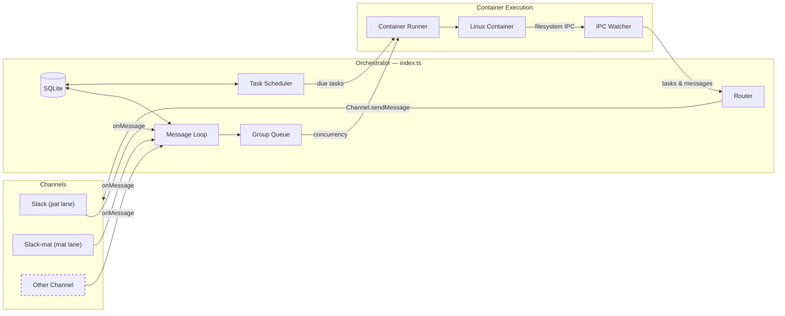

# NanoClaw Specification

A personal Claude assistant with multi-channel support, persistent memory per conversation, scheduled tasks, and container-isolated agent execution.

---

## Table of Contents

1. [Architecture](#architecture)
2. [Architecture: Channel System](#architecture-channel-system)
3. [Folder Structure](#folder-structure)
4. [Configuration](#configuration)
5. [Memory System](#memory-system)
6. [Session Management](#session-management)
7. [Message Flow](#message-flow)
8. [Commands](#commands)
9. [Scheduled Tasks](#scheduled-tasks)
10. [MCP Servers](#mcp-servers)
11. [Deployment](#deployment)
12. [Security Considerations](#security-considerations)

---

## Architecture

```
┌──────────────────────────────────────────────────────────────────────┐
│                        HOST (macOS / Linux)                           │
│                     (Main Node.js Process)                            │
├──────────────────────────────────────────────────────────────────────┤
│                                                                       │
│  ┌──────────────────┐                  ┌────────────────────┐        │
│  │ Channels         │─────────────────▶│   SQLite Database  │        │
│  │ (self-register   │◀────────────────│   (messages.db)    │        │
│  │  at startup)     │  store/send      └─────────┬──────────┘        │
│  └──────────────────┘                            │                   │
│                                                   │                   │
│         ┌─────────────────────────────────────────┘                   │
│         │                                                             │
│         ▼                                                             │
│  ┌──────────────────┐    ┌──────────────────┐    ┌───────────────┐   │
│  │  Message Loop    │    │  Scheduler Loop  │    │  IPC Watcher  │   │
│  │  (polls SQLite)  │    │  (checks tasks)  │    │  (file-based) │   │
│  └────────┬─────────┘    └────────┬─────────┘    └───────────────┘   │
│           │                       │                                   │
│           └───────────┬───────────┘                                   │
│                       │ spawns container                              │
│                       ▼                                               │
├──────────────────────────────────────────────────────────────────────┤
│                     CONTAINER (Linux VM)                               │
├──────────────────────────────────────────────────────────────────────┤
│  ┌──────────────────────────────────────────────────────────────┐    │
│  │                    AGENT RUNNER                               │    │
│  │                                                                │    │
│  │  Working directory: /workspace/group (mounted from host)       │    │
│  │  Volume mounts:                                                │    │
│  │    • groups/{name}/ → /workspace/group                         │    │
│  │    • groups/global/ → /workspace/global/ (non-main only)       │    │
│  │    • data/sessions/{group}/.claude/ → /home/node/.claude/      │    │
│  │    • Additional dirs → /workspace/extra/*                      │    │
│  │                                                                │    │
│  │  Tools (all groups):                                           │    │
│  │    • Bash (safe - sandboxed in container!)                     │    │
│  │    • Read, Write, Edit, Glob, Grep (file operations)           │    │
│  │    • WebSearch, WebFetch (internet access)                     │    │
│  │    • agent-browser (browser automation)                        │    │
│  │    • mcp__nanoclaw__* (scheduler tools via IPC)                │    │
│  │                                                                │    │
│  └──────────────────────────────────────────────────────────────┘    │
│                                                                       │
└───────────────────────────────────────────────────────────────────────┘
```

### Technology Stack

| Component | Technology | Purpose |
|-----------|------------|---------|
| Channel System | Channel registry (`src/channels/registry.ts`) | Channels self-register at startup |
| Message Storage | SQLite (better-sqlite3) | Store messages for polling |
| Container Runtime | Containers (Linux VMs) | Isolated environments for agent execution |
| Agent CLI | Claude Code CLI / Codex CLI (installed in container image) | Spawned per turn by `container-runner`; choice per lane |
| Secret Proxy | OneCLI gateway (`@onecli-sh/sdk`) | Injects API keys/tokens into containers at request time |
| Browser Automation | agent-browser + Chromium | Web interaction and screenshots |
| Runtime | Node.js 20+ | Host process for routing and scheduling |

---

## Architecture: Channel System

This fork ships with two Slack lanes (`slack` / `slack-mat`) as channels. Each channel lives under `src/channels/` and self-registers at startup; channels with missing credentials emit a WARN log and are skipped. Gmail is not a channel in this fork — it is exposed to the container agent as an MCP tool (see `/add-gmail` skill).

### System Diagram



### Channel Registry

The channel system is built on a factory registry in `src/channels/registry.ts`:

```typescript
export type ChannelFactory = (opts: ChannelOpts) => Channel | null;

const registry = new Map<string, ChannelFactory>();

export function registerChannel(name: string, factory: ChannelFactory): void {
  registry.set(name, factory);
}

export function getChannelFactory(name: string): ChannelFactory | undefined {
  return registry.get(name);
}

export function getRegisteredChannelNames(): string[] {
  return [...registry.keys()];
}
```

Each factory receives `ChannelOpts` (callbacks for `onMessage`, `onChatMetadata`, and `registeredGroups`) and returns either a `Channel` instance or `null` if that channel's credentials are not configured.

### Channel Interface

Every channel implements this interface (defined in `src/types.ts`):

```typescript
interface Channel {
  name: string;
  connect(): Promise<void>;
  sendMessage(jid: string, text: string): Promise<void>;
  isConnected(): boolean;
  ownsJid(jid: string): boolean;
  disconnect(): Promise<void>;
  setTyping?(jid: string, isTyping: boolean): Promise<void>;
  syncGroups?(force: boolean): Promise<void>;
}
```

### Self-Registration Pattern

Channels self-register using a barrel-import pattern:

1. Each channel file in `src/channels/` (e.g. `slack.ts`, `slack-mat.ts`) calls `registerChannel()` at module load time:

   ```typescript
   // src/channels/slack.ts
   import { registerChannel, ChannelOpts } from './registry.js';

   export class SlackChannel implements Channel { /* ... */ }

   registerChannel('slack', (opts: ChannelOpts) => {
     // Return null if credentials are missing
     if (!process.env.SLACK_PAT_BOT_TOKEN) return null;
     return new SlackChannel(opts);
   });
   ```

2. The barrel file `src/channels/index.ts` imports all channel modules, triggering registration:

   ```typescript
   // src/channels/index.ts
   import './slack.js';     // pat lane
   import './slack-mat.js'; // mat lane
   ```

3. At startup, the orchestrator (`src/index.ts`) loops through registered channels and connects whichever ones return a valid instance:

   ```typescript
   for (const name of getRegisteredChannelNames()) {
     const factory = getChannelFactory(name);
     const channel = factory?.(channelOpts);
     if (channel) {
       await channel.connect();
       channels.push(channel);
     }
   }
   ```

### Key Files

| File | Purpose |
|------|---------|
| `src/channels/registry.ts` | Channel factory registry |
| `src/channels/index.ts` | Barrel imports that trigger channel self-registration |
| `src/types.ts` | `Channel` interface, `ChannelOpts`, message types |
| `src/index.ts` | Orchestrator — instantiates channels, runs message loop |
| `src/router.ts` | Finds the owning channel for a JID |
| `src/formatting.ts` | Message formatting helpers (escape, format, strip, outbound) |

### Adding a New Channel

To add a new channel:

1. Add a `src/channels/<name>.ts` file implementing the `Channel` interface
2. Call `registerChannel(name, factory)` at module load
3. Return `null` from the factory if credentials are missing
4. Add an import line to `src/channels/index.ts`

See `src/channels/slack.ts` for the reference implementation.

---

## Folder Structure

```
nanoclaw/
├── CLAUDE.md                      # Project context for Claude Code
├── docs/
│   ├── SPEC.md                    # This specification document
│   ├── SECURITY.md                # Security model
│   ├── SDK_DEEP_DIVE.md           # Agent SDK internals
│   ├── DEBUG_CHECKLIST.md         # Debugging checklist
│   └── APPLE-CONTAINER-NETWORKING.md  # Apple container networking notes
├── README.md                      # User documentation
├── package.json                   # Node.js dependencies
├── tsconfig.json                  # TypeScript configuration
├── .mcp.json                      # MCP server configuration (reference)
├── .gitignore
│
├── src/
│   ├── index.ts                   # Orchestrator: state, message loop, agent invocation
│   ├── channels/
│   │   ├── registry.ts            # Channel factory registry
│   │   ├── index.ts               # Barrel imports for channel self-registration
│   │   ├── slack.ts               # Slack pat-lane channel
│   │   └── slack-mat.ts           # Slack mat-lane channel
│   ├── config.ts                  # Configuration constants (triggers, paths, timeouts)
│   ├── types.ts                   # TypeScript interfaces (Channel, ChannelOpts, etc.)
│   ├── db.ts                      # SQLite initialization and queries
│   ├── db-schema.ts               # Schema definitions and migrations
│   ├── router.ts                  # Finds the owning channel for a JID
│   ├── formatting.ts              # Message formatting helpers
│   ├── ipc.ts                     # IPC watcher and task processing
│   ├── container-runner.ts        # Spawns agents in containers
│   ├── container-runtime.ts       # Container binary detection and lifecycle
│   ├── container-credentials.ts   # OneCLI credential injection for containers
│   ├── container-mounts.ts        # Volume mount assembly
│   ├── container-path-translator.ts # Host↔container path mapping
│   ├── group-queue.ts             # Per-group queue with global concurrency limit
│   ├── group-folder.ts            # Group folder name resolution
│   ├── group-state.ts             # In-memory group state tracking
│   ├── task-scheduler.ts          # Runs scheduled tasks when due
│   ├── schedule-utils.ts          # Cron/interval/once helpers
│   ├── session-commands.ts        # Session reset / management commands
│   ├── session-cleanup.ts         # Stale session auto-cleanup
│   ├── session-reset.ts           # "세션초기화" handler
│   ├── remote-control.ts          # Remote restart/reload triggers
│   ├── lab-dashboard.ts           # Lab dashboard trigger handler
│   ├── codex-usage.ts             # Codex API usage tracking
│   ├── transcribe.ts              # WhisperX (faster-whisper + pyannote) audio transcription
│   ├── sender-allowlist.ts        # Per-channel sender allowlist
│   ├── mount-security.ts          # Mount allowlist validation
│   ├── ipc-auth.ts                # IPC authentication
│   ├── env.ts                     # .env file reader
│   ├── timezone.ts                # IANA timezone resolution
│   ├── text-styles.ts             # Text style helpers
│   ├── logger.ts                  # Pino logger setup
│   └── *.test.ts                  # Co-located unit tests
│
├── container/
│   ├── Dockerfile                 # Container image (runs as 'node' user, includes Claude Code CLI)
│   ├── build.sh                   # Build script for container image
│   ├── agent-runner/              # Code that runs inside the container
│   │   ├── package.json
│   │   ├── tsconfig.json
│   │   └── src/
│   │       ├── index.ts           # Entry point (query loop, IPC polling, session resume)
│   │       ├── sdk-adapter.ts     # Common adapter interface for agent SDKs
│   │       ├── claude-adapter.ts  # Claude Code CLI adapter
│   │       ├── codex-adapter.ts   # Codex CLI adapter
│   │       ├── shared.ts          # Shared helpers (conversation archive, etc.)
│   │       └── ipc-mcp-stdio.ts   # Stdio-based MCP server for host communication
│   └── skills/
│       ├── agent-browser/         # Browser automation skill
│       ├── capabilities/          # Capability declarations
│       ├── slack-formatting/      # Slack markup conversion
│       └── status/                # Status reporting skill
│
├── dist/                          # Compiled JavaScript (gitignored)
│
├── .claude/
│   └── skills/
│       ├── setup/SKILL.md              # /setup - First-time installation
│       ├── customize/SKILL.md          # /customize - Add capabilities
│       ├── debug/SKILL.md              # /debug - Container debugging
│       ├── add-slack/SKILL.md          # /add-slack - Slack channel
│       ├── add-gmail/SKILL.md          # /add-gmail - Gmail integration
│       ├── add-compact/SKILL.md        # /add-compact - /compact command
│       ├── add-ollama-tool/SKILL.md    # /add-ollama-tool - Ollama MCP server
│       └── channel-formatting/SKILL.md # /channel-formatting - Per-channel syntax
│
├── groups/
│   ├── CLAUDE.md                  # Global memory (all groups read this)
│   ├── slack_main/                 # Main control channel
│   │   ├── CLAUDE.md              # Main channel memory
│   │   └── logs/                  # Task execution logs
│   └── {channel}_{name}_{bot}/     # Per-group folders (e.g. slack_family-chat_pat, slack_dev-team_mat)
│       ├── CLAUDE.md              # Group-specific memory
│       ├── logs/                  # Task logs for this group
│       └── *.md                   # Files created by the agent
│
├── store/                         # Local data (gitignored)
│   └── messages.db                # SQLite database (messages, chats, scheduled_tasks, task_run_logs, registered_groups, sessions, router_state)
│
├── data/                          # Application state (gitignored)
│   ├── sessions/                  # Per-group session data (.claude/ dirs with JSONL transcripts)
│   ├── env/env                    # Copy of .env for container mounting
│   └── ipc/                       # Container IPC (messages/, tasks/)
│
├── logs/                          # Runtime logs (gitignored)
│   ├── nanoclaw.log               # Host stdout
│   └── nanoclaw.error.log         # Host stderr
│   # Note: Per-container logs are in groups/{folder}/logs/container-*.log
│
└── launchd/
    └── com.nanoclaw.plist         # macOS service configuration
```

---

## Configuration

Configuration constants are in `src/config.ts`:

Key constants (see `src/config.ts` for full source):

| Constant | Default | Purpose |
|----------|---------|---------|
| `PAT_ASSISTANT_NAME` | `'패트'` | Pat bot display name (env / `.env`) |
| `MAT_ASSISTANT_NAME` | `'매트'` | Mat bot display name (env / `.env`) |
| `POLL_INTERVAL` | `2000` ms | Message loop polling interval |
| `SCHEDULER_POLL_INTERVAL` | `60000` ms | Scheduler loop interval |
| `CONTAINER_IMAGE` | `nanoclaw-agent:latest` | Container image name |
| `CONTAINER_TIMEOUT` | `1800000` ms (30 min) | Max container run time |
| `IDLE_TIMEOUT` | `1800000` ms (30 min) | Keep container alive after last result |
| `MAX_CONCURRENT_CONTAINERS` | `5` | Global concurrency cap |
| `ONECLI_URL` | `http://localhost:10254` | OneCLI gateway address |
| `MAX_MESSAGES_PER_PROMPT` | `10` | Message catch-up limit |

Paths (`STORE_DIR`, `GROUPS_DIR`, `DATA_DIR`) are resolved as absolute from `process.cwd()` — required for container volume mounts.

`getGroupBotName(chatJid)` returns `MAT_ASSISTANT_NAME` for `slack-mat:*` JIDs, `PAT_ASSISTANT_NAME` otherwise. `buildTriggerPattern(trigger)` builds a per-group trigger regex.

### Container Configuration

Groups can have additional directories mounted via `containerConfig` in the SQLite `registered_groups` table (stored as JSON in the `container_config` column). Example registration:

```typescript
setRegisteredGroup("slack:C0123456789", {
  name: "Dev Team",
  folder: "slack_dev-team_pat",
  trigger: "@패트",
  added_at: new Date().toISOString(),
  containerConfig: {
    additionalMounts: [
      {
        hostPath: "~/projects/webapp",
        containerPath: "webapp",
        readonly: false,
      },
    ],
    timeout: 600000,
  },
});
```

Folder names follow the convention `{channel}_{group-name}_{bot}` (e.g., `slack_family-chat_pat`, `slack_dev-team_mat`). The main group has `isMain: true` set during registration.

Additional mounts appear at `/workspace/extra/{containerPath}` inside the container.

**Mount syntax note:** Read-write mounts use `-v host:container`, but readonly mounts require `--mount "type=bind,source=...,target=...,readonly"` (the `:ro` suffix may not work on all runtimes).

### Secret Management (OneCLI)

API keys and credentials are **not** stored in `.env` or passed to containers directly. The OneCLI gateway (`ONECLI_URL`, default `http://localhost:10254`) handles secret injection at request time:

- `container-credentials.ts` calls OneCLI to obtain per-container secrets
- Secrets are injected into the container environment by the runner — never written to disk inside the container
- Supported secrets: Claude API keys, Codex API keys, Slack tokens, and any other credentials registered in OneCLI

See `onecli --help` for secret registration and agent assignment.

### Changing the Assistant Name

Set the `PAT_ASSISTANT_NAME` environment variable:

```bash
PAT_ASSISTANT_NAME=Bot npm start
```

Or edit the default in `src/config.ts`. This changes:
- The trigger pattern (messages must start with `@YourName`)
- The response prefix (`YourName:` added automatically)

### Placeholder Values in launchd

Files with `{{PLACEHOLDER}}` values need to be configured:
- `{{PROJECT_ROOT}}` - Absolute path to your nanoclaw installation
- `{{NODE_PATH}}` - Path to node binary (detected via `which node`)
- `{{HOME}}` - User's home directory

---

## Memory System

NanoClaw uses a hierarchical memory system based on CLAUDE.md files.

### Memory Hierarchy

| Level | Location | Read By | Written By | Purpose |
|-------|----------|---------|------------|---------|
| **Global** | `groups/CLAUDE.md` | All groups | Main only | Preferences, facts, context shared across all conversations |
| **Group** | `groups/{name}/CLAUDE.md` | That group | That group | Group-specific context, conversation memory |
| **Files** | `groups/{name}/*.md` | That group | That group | Notes, research, documents created during conversation |

### How Memory Works

1. **Agent Context Loading**
   - Agent runs with `cwd` set to `groups/{group-name}/`
   - Claude Agent SDK with `settingSources: ['project']` automatically loads:
     - `../CLAUDE.md` (parent directory = global memory)
     - `./CLAUDE.md` (current directory = group memory)

2. **Writing Memory**
   - When user says "remember this", agent writes to `./CLAUDE.md`
   - When user says "remember this globally" (main channel only), agent writes to `../CLAUDE.md`
   - Agent can create files like `notes.md`, `research.md` in the group folder

3. **Main Channel Privileges**
   - Only the "main" group (self-chat) can write to global memory
   - Main can manage registered groups and schedule tasks for any group
   - Main can configure additional directory mounts for any group
   - All groups have Bash access (safe because it runs inside container)

---

## Session Management

Sessions enable conversation continuity - Claude remembers what you talked about.

### How Sessions Work

1. Each group has a session ID stored in SQLite (`sessions` table, keyed by `group_folder`)
2. Session ID is passed to Claude Agent SDK's `resume` option
3. Claude continues the conversation with full context
4. Session transcripts are stored as JSONL files in `data/sessions/{group}/.claude/`

---

## Message Flow

### Incoming Message Flow

```
1. User sends a message via any connected channel
   │
   ▼
2. Channel receives message (e.g. Bolt Socket Mode for Slack, IMAP/Gmail API for Gmail)
   │
   ▼
3. Message stored in SQLite (store/messages.db)
   │
   ▼
4. Message loop polls SQLite (every 2 seconds)
   │
   ▼
5. Router checks:
   ├── Is chat_jid in registered groups (SQLite)? → No: ignore
   └── Does message match trigger pattern? → No: store but don't process
   │
   ▼
6. Router catches up conversation:
   ├── Fetch all messages since last agent interaction
   ├── Format with timestamp and sender name
   └── Build prompt with full conversation context
   │
   ▼
7. Router invokes Claude Agent SDK:
   ├── cwd: groups/{group-name}/
   ├── prompt: conversation history + current message
   ├── resume: session_id (for continuity)
   └── mcpServers: nanoclaw (scheduler)
   │
   ▼
8. Claude processes message:
   ├── Reads CLAUDE.md files for context
   └── Uses tools as needed (search, email, etc.)
   │
   ▼
9. Router prefixes response with assistant name and sends via the owning channel
   │
   ▼
10. Router updates last agent timestamp and saves session ID
```

### Trigger Word Matching

Messages must start with the group's trigger pattern (default: `@패트`; mat-lane groups use `@매트`):
- `@패트 what's the weather?` → Triggers pat agent
- `@매트 이거 분석해줘` → Triggers mat agent
- `Hey @패트` → Ignored (trigger not at start)
- `What's up?` → Ignored (no trigger)

### Conversation Catch-Up

When a triggered message arrives, the agent receives all messages since its last interaction in that chat. Each message is formatted with timestamp and sender name:

```
[Jan 31 2:32 PM] John: hey everyone, should we do pizza tonight?
[Jan 31 2:33 PM] Sarah: sounds good to me
[Jan 31 2:35 PM] John: @패트 what toppings do you recommend?
```

This allows the agent to understand the conversation context even if it wasn't mentioned in every message.

---

## Commands

### Commands Available in Any Group

| Command | Example | Effect |
|---------|---------|--------|
| `@Assistant [message]` | `@패트 what's the weather?` | Talk to Claude |

### Commands Available in Main Channel Only

| Command | Example | Effect |
|---------|---------|--------|
| `@Assistant add group "Name"` | `@패트 add group "Family Chat"` | Register a new group |
| `@Assistant remove group "Name"` | `@패트 remove group "Work Team"` | Unregister a group |
| `@Assistant list groups` | `@패트 list groups` | Show registered groups |
| `@Assistant remember [fact]` | `@패트 remember I prefer dark mode` | Add to global memory |

---

## Scheduled Tasks

NanoClaw has a built-in scheduler that runs tasks as full agents in their group's context.

### How Scheduling Works

1. **Group Context**: Tasks created in a group run with that group's working directory and memory
2. **Full Agent Capabilities**: Scheduled tasks have access to all tools (WebSearch, file operations, etc.)
3. **Optional Messaging**: Tasks can send messages to their group using the `send_message` tool, or complete silently
4. **Main Channel Privileges**: The main channel can schedule tasks for any group and view all tasks

### Schedule Types

| Type | Value Format | Example |
|------|--------------|---------|
| `cron` | Cron expression | `0 9 * * 1` (Mondays at 9am) |
| `interval` | Milliseconds | `3600000` (every hour) |
| `once` | ISO timestamp | `2024-12-25T09:00:00Z` |

### Creating a Task

```
User: @패트 remind me every Monday at 9am to review the weekly metrics

Claude: [calls mcp__nanoclaw__schedule_task]
        {
          "prompt": "Send a reminder to review weekly metrics. Be encouraging!",
          "schedule_type": "cron",
          "schedule_value": "0 9 * * 1"
        }

Claude: Done! I'll remind you every Monday at 9am.
```

### One-Time Tasks

```
User: @패트 at 5pm today, send me a summary of today's emails

Claude: [calls mcp__nanoclaw__schedule_task]
        {
          "prompt": "Search for today's emails, summarize the important ones, and send the summary to the group.",
          "schedule_type": "once",
          "schedule_value": "2024-01-31T17:00:00Z"
        }
```

### Managing Tasks

From any group:
- `@패트 list my scheduled tasks` - View tasks for this group
- `@패트 pause task [id]` - Pause a task
- `@패트 resume task [id]` - Resume a paused task
- `@패트 cancel task [id]` - Delete a task

From main channel:
- `@패트 list all tasks` - View tasks from all groups
- `@패트 schedule task for "Family Chat": [prompt]` - Schedule for another group

---

## MCP Servers

### NanoClaw MCP (built-in)

The `nanoclaw` MCP server is created dynamically per agent call with the current group's context.

**Available Tools:**
| Tool | Purpose |
|------|---------|
| `schedule_task` | Schedule a recurring or one-time task |
| `list_tasks` | Show tasks (group's tasks, or all if main) |
| `get_task` | Get task details and run history |
| `update_task` | Modify task prompt or schedule |
| `pause_task` | Pause a task |
| `resume_task` | Resume a paused task |
| `cancel_task` | Delete a task |
| `send_message` | Send a message to the group via its channel |

---

## Deployment

NanoClaw runs as a system service — macOS (launchd) or Linux (systemd).

### Startup Sequence

When NanoClaw starts, it:
1. **Ensures container runtime is running** - Automatically starts it if needed; kills orphaned NanoClaw containers from previous runs
2. Initializes the SQLite database (migrates from JSON files if they exist)
3. Loads state from SQLite (registered groups, sessions, router state)
4. **Connects channels** — loops through registered channels, instantiates those with credentials, calls `connect()` on each
5. Once at least one channel is connected:
   - Starts the scheduler loop
   - Starts the IPC watcher for container messages
   - Sets up the per-group queue with `processGroupMessages`
   - Recovers any unprocessed messages from before shutdown
   - Starts the message polling loop

### Service: com.nanoclaw

**launchd/com.nanoclaw.plist:**
```xml
<?xml version="1.0" encoding="UTF-8"?>
<!DOCTYPE plist PUBLIC "-//Apple//DTD PLIST 1.0//EN" "...">
<plist version="1.0">
<dict>
    <key>Label</key>
    <string>com.nanoclaw</string>
    <key>ProgramArguments</key>
    <array>
        <string>{{NODE_PATH}}</string>
        <string>{{PROJECT_ROOT}}/dist/index.js</string>
    </array>
    <key>WorkingDirectory</key>
    <string>{{PROJECT_ROOT}}</string>
    <key>RunAtLoad</key>
    <true/>
    <key>KeepAlive</key>
    <true/>
    <key>EnvironmentVariables</key>
    <dict>
        <key>PATH</key>
        <string>{{HOME}}/.local/bin:/usr/local/bin:/usr/bin:/bin</string>
        <key>HOME</key>
        <string>{{HOME}}</string>
        <key>PAT_ASSISTANT_NAME</key>
        <string>패트</string>
        <key>MAT_ASSISTANT_NAME</key>
        <string>매트</string>
    </dict>
    <key>StandardOutPath</key>
    <string>{{PROJECT_ROOT}}/logs/nanoclaw.log</string>
    <key>StandardErrorPath</key>
    <string>{{PROJECT_ROOT}}/logs/nanoclaw.error.log</string>
</dict>
</plist>
```

### Managing the Service

```bash
# Install service
cp launchd/com.nanoclaw.plist ~/Library/LaunchAgents/

# Start service
launchctl load ~/Library/LaunchAgents/com.nanoclaw.plist

# Stop service
launchctl unload ~/Library/LaunchAgents/com.nanoclaw.plist

# Check status
launchctl list | grep nanoclaw

# View logs
tail -f logs/nanoclaw.log
```

---

## Security Considerations

### Container Isolation

All agents run inside containers (lightweight Linux VMs), providing:
- **Filesystem isolation**: Agents can only access mounted directories
- **Safe Bash access**: Commands run inside the container, not on your Mac
- **Network isolation**: Can be configured per-container if needed
- **Process isolation**: Container processes can't affect the host
- **Non-root user**: Container runs as unprivileged `node` user (uid 1000)

### Prompt Injection Risk

Inbound channel messages could contain malicious instructions attempting to manipulate Claude's behavior.

**Mitigations:**
- Container isolation limits blast radius
- Only registered groups are processed
- Trigger word required (reduces accidental processing)
- Agents can only access their group's mounted directories
- Main can configure additional directories per group
- Claude's built-in safety training

**Recommendations:**
- Only register trusted groups
- Review additional directory mounts carefully
- Review scheduled tasks periodically
- Monitor logs for unusual activity

### Credential Storage

| Credential | Storage Location | Notes |
|------------|------------------|-------|
| API keys (Claude, Codex, etc.) | OneCLI gateway | Injected at container spawn time — never on disk inside container |
| Slack tokens | `.env` (SLACK_PAT_*, SLACK_MAT_*) | Read by host process at startup |
| Session state | data/sessions/{group}/.claude/ | Per-group isolation, mounted to /home/node/.claude/ |

### File Permissions

The groups/ folder contains personal memory and should be protected:
```bash
chmod 700 groups/
```

---

## Troubleshooting

### Common Issues

| Issue | Cause | Solution |
|-------|-------|----------|
| No response to messages | Service not running | Check `launchctl list | grep nanoclaw` |
| "Claude Code process exited with code 1" | Container runtime failed to start | Check logs; NanoClaw auto-starts container runtime but may fail |
| "Claude Code process exited with code 1" | Session mount path wrong | Ensure mount is to `/home/node/.claude/` not `/root/.claude/` |
| Session not continuing | Session ID not saved | Check SQLite: `sqlite3 store/messages.db "SELECT * FROM sessions"` |
| Session not continuing | Mount path mismatch | Container user is `node` with HOME=/home/node; sessions must be at `/home/node/.claude/` |
| "No groups registered" | Haven't added groups | Use `@패트 add group "Name"` in main |

### Log Location

- `logs/nanoclaw.log` - stdout
- `logs/nanoclaw.error.log` - stderr

### Debug Mode

Run manually for verbose output:
```bash
npm run dev
# or
node dist/index.js
```
